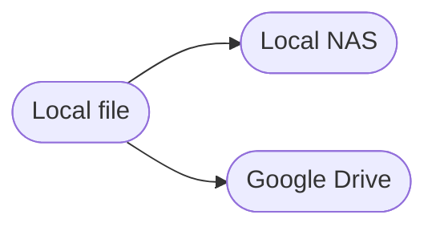

#### Current structure

#### Automated processes

Sorting my pictures
Nam ut rutrum ex, venenatis sollicitudin urna. Aliquam erat volutpat. Integer eu ipsum sem. Ut bibendum lacus vestibulum maximus suscipit. Quisque vitae nibh iaculis neque blandit euismod.

> Lorem ipsum dolor sit amet consectetur adipisicing elit. Nemo vel ad consectetur ut aperiam. Itaque eligendi natus aperiam? Excepturi repellendus consequatur quibusdam optio expedita praesentium est adipisci dolorem ut eius!

#### Interactive disk organization

Lorem ipsum dolor sit amet consectetur adipisicing elit. Nemo vel ad consectetur ut aperiam. Itaque eligendi natus aperiam? Excepturi repellendus consequatur quibusdam optio expedita praesentium est adipisci dolorem ut eius! Lorem ipsum dolor sit amet consectetur adipisicing elit. Nemo vel ad consectetur ut aperiam. Itaque eligendi natus aperiam? Excepturi repellendus consequatur quibusdam optio expedita praesentium est adipisci dolorem ut eius!



Lorem ipsum dolor sit amet consectetur adipisicing elit. Nemo vel ad consectetur ut aperiam. Itaque eligendi natus aperiam? Excepturi repellendus consequatur quibusdam optio expedita praesentium est adipisci dolorem ut eius! Lorem ipsum dolor sit amet consectetur adipisicing elit. Nemo vel ad consectetur ut aperiam. Itaque eligendi natus aperiam? Excepturi repellendus consequatur quibusdam optio expedita praesentium est adipisci dolorem ut eius!

Photo credits: Photo by Sharon McCutcheon on Unsplash
  